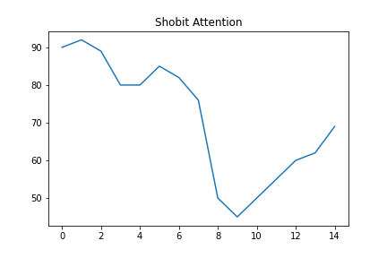
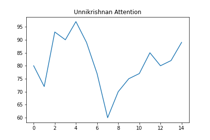
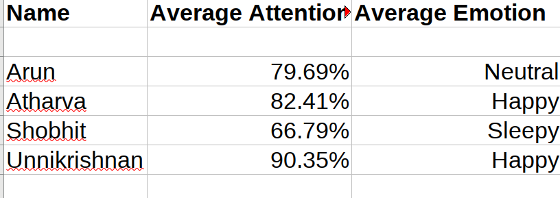

# Invictus

This repository contains codes and demonstrations of our project that was completed during HackOff v3.0 2020.

## Problem

The current Covid-19 pandemic has shown the world that conventional teaching methods aren't the only reliable teaching methods. This year, almost every educational institutions, all over the world have shifted away from classrooms to online classes. However, there are limitations to online classes.

* Teachers cannot properly monitor the students online.

* Students become distracted and stop paying attention to the class.

* Teachers cannot percieve whether actual learning is taking place.

* Students use this as an opportunity to cheat durinng online exams.

* Teachers are unable to asses the quality of their classes because they can't see the students' emotions while presenting.

## Solution

This projects calculates students' attention and emotions in an online class to help teachers better understand and monitor the students.

* Using head pose estimation model, we are able to detect if students are paying attention to the class.

* According to that model, we provide a score between 0 to 100 for every frame per person.

* We use deep emotion recognition model on the video stream to detect and monitor the emotions of the students during class.

* We use deep facial recognition model to reconize the student's faces in the video.

* All this data is compiled into a visualizer and the output is provided to the faculty at the end of every session.

***Demonstration***

This is a demonstration on Google Meet

***Get detailed attention graphs***

PS: Kindly view this graph on Github light theme.

***Final Report***

## Future Scope

* Integrate it with major video conferencing applications like MS Teams, Zoom and Google Meet.

* Get more data from the video stream.

* Present it in a website, accessible to the teachers via login.

## Team Members
* [**Shobhit Tulshain**](https://github.com/Shobhit2000)
* [**Atharva Hudlikar**](https://github.com/Mastermind0100)
* [**Arunkumar L**](https://github.com/CleanPegasus)
* [**Unnikrishnan Menon**](https://github.com/7enTropy7)
